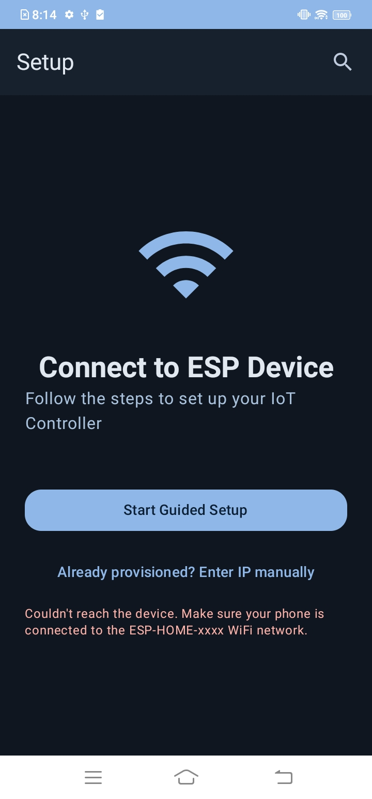
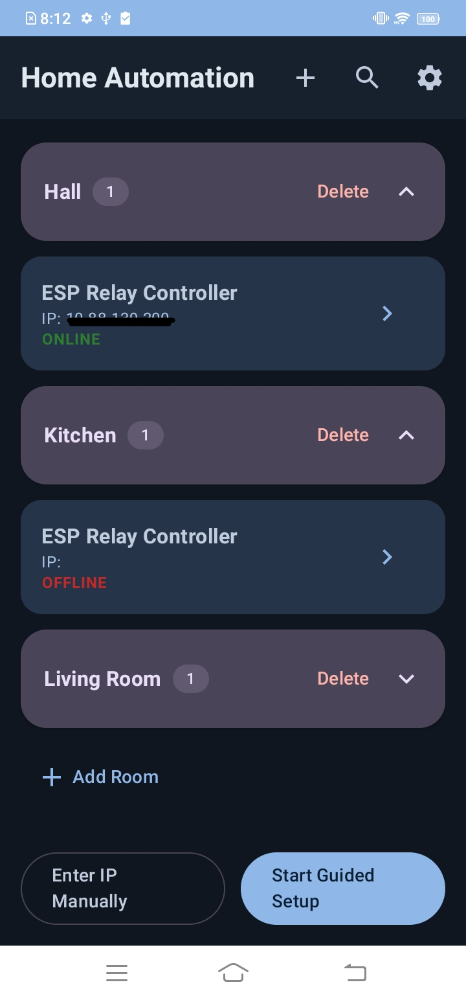
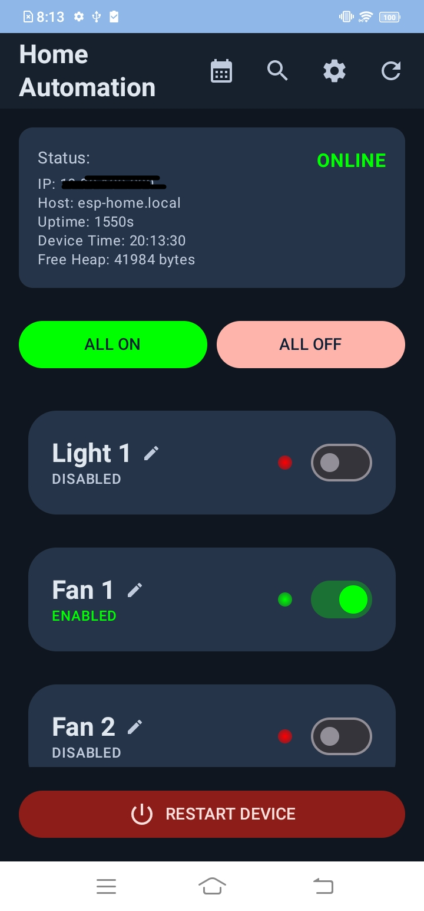
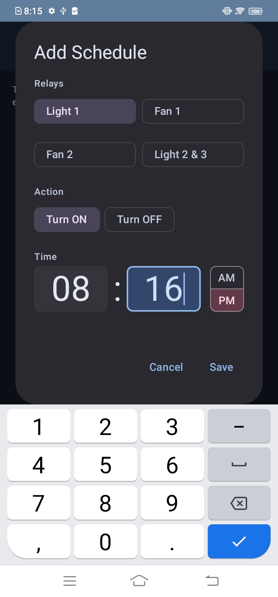
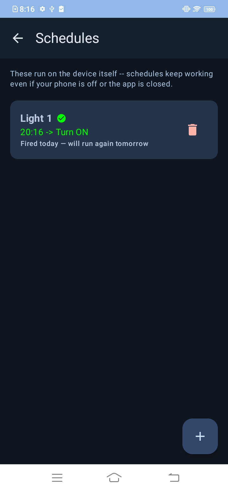
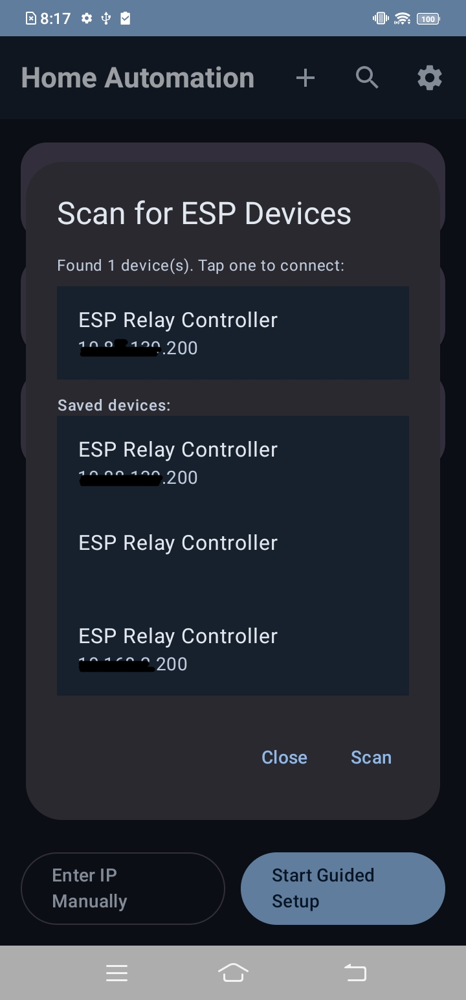

# ESP-Smart-Home-App – Local-First IoT Relay Controller

> A complete **Android + ESP8266/ESP32** smart home ecosystem for controlling relay devices over the local network with **real-time communication**, **guided provisioning**, and **on-device automation**.


---

# Overview

ESP-App is a complete **Local-First IoT platform** designed to control ESP8266/ESP32 relay devices without relying on cloud infrastructure.

Unlike traditional IoT ecosystems that depend on external cloud services, this project communicates directly with devices using **REST APIs** and **WebSockets** over the local Wi-Fi network.

The result is:

- ⚡ Extremely low latency relay control
- 🔒 Complete local privacy
- 🌐 Works without Internet access
- 📱 Native Android experience using Jetpack Compose
- 🔄 Real-time synchronization across multiple clients

---

# Features

## Android Application

- Modern Material 3 UI
- Kotlin + Jetpack Compose
- MVVM Architecture
- Room-based device organization
- Guided ESP onboarding
- Local network device discovery
- Real-time relay dashboard
- Relay scheduling interface
- Persistent settings with DataStore
- Dynamic light/dark themes
- Automatic device reconnect
- Network health monitoring

---

## ESP Firmware

- REST API server
- WebSocket server
- Wi-Fi provisioning
- Controls up to 4 hardware relays
- NTP time synchronization
- Persistent schedule storage
- EEPROM configuration storage
- Hardware-side automation
- Real-time event broadcasting

---

# System Architecture

```
                Home Wi-Fi Network

      +-------------------------------+
      |                               |
      | Android Application           |
      | Kotlin • Compose • MVVM       |
      +--------------+----------------+
                     |
            REST + WebSockets
                     |
      +--------------v----------------+
      | ESP8266 / ESP32               |
      | REST Server                   |
      | WebSocket Server              |
      | EEPROM                        |
      | NTP                           |
      +--------------+----------------+
                     |
             Controls GPIO Relays
                     |
        +------+-------+-------+------+
        | R1   | R2    | R3    | R4   |
        +------+-------+-------+------+
```

---

# Why Local-First?

Most IoT applications depend on cloud services for communication.

ESP-App follows a **Local-First** architecture where every interaction happens directly between the Android application and ESP devices over the local network.

### Advantages

- ⚡ Relay switching in under 100 ms
- 🔒 No cloud dependency
- 🌐 Works even without Internet
- 💰 Zero cloud hosting costs
- 🔄 Instant synchronization through WebSockets
- 🏠 Complete ownership of your smart home

---

# Technical Highlights

## Guided Device Provisioning

A brand-new ESP device automatically enters **Access Point Mode** when no Wi-Fi credentials are found.

Provisioning workflow:

```
ESP Boots
      │
      ▼
Access Point Mode
      │
      ▼
Android connects to ESP
      │
      ▼
ESP scans nearby Wi-Fi
      │
      ▼
User selects network
      │
      ▼
Credentials sent via REST
      │
      ▼
ESP stores credentials
      │
      ▼
Automatic reboot
      │
      ▼
Android discovers new IP
      │
      ▼
Device Ready
```

This provides an onboarding experience similar to commercial IoT products.

---

## Real-Time WebSocket Engine

Relay control is handled through a persistent WebSocket connection instead of repeated HTTP polling.

Features:

- Low latency communication
- Instant relay updates
- Broadcast state synchronization
- Automatic reconnection
- Multiple clients stay synchronized

Example payload

```json
{
  "cmd": "relay",
  "id": 1,
  "state": true
}
```

---

## Intelligent Network Scanner

Finding devices after router IP changes is a common IoT problem.

ESP-App solves this by:

- Detecting the current subnet
- Scanning the local `/24` network
- Sending concurrent HTTP probes
- Fingerprinting devices using response fields
- Automatically identifying compatible ESP devices

This removes the need for manual IP entry.

---

## Adaptive Static IP Strategy

Instead of requiring router configuration, the firmware automatically creates a predictable address.

Workflow:

1. Request DHCP address
2. Learn gateway and subnet
3. Disconnect
4. Reconnect using a preferred static address
5. Android app reconnects automatically

This makes devices easy to locate while remaining portable across different routers.

---

## Hardware Scheduling

Schedules execute directly on the ESP device.

Even if:

- the phone is turned off
- the application is closed
- the Android device leaves the network

scheduled relay actions continue to execute.

Features:

- NTP synchronization
- EEPROM persistence
- Multiple schedule slots
- Duplicate trigger prevention

---

# Android Architecture

The Android application follows the **MVVM** design pattern.

```
UI (Jetpack Compose)
        │
        ▼
ViewModel
        │
        ▼
Repository
        │
 ┌──────┴────────┐
 │               │
REST API     WebSocket
 │               │
 └──────┬────────┘
        ▼
ESP Device
```

---

# Technology Stack

## Android

- Kotlin
- Jetpack Compose
- Material 3
- MVVM
- Retrofit
- OkHttp
- WebSockets
- Kotlin Coroutines
- Flow
- Jetpack Navigation
- DataStore

---

## Firmware

- Arduino Framework
- ESP8266 / ESP32
- ESP8266WebServer
- WebSocketsServer
- EEPROM
- NTP Client
- Wi-Fi Manager

---

# REST API

| Endpoint | Description |
|-----------|-------------|
| `/status` | Device status |
| `/scan` | Scan nearby Wi-Fi networks |
| `/connect` | Configure Wi-Fi credentials |
| `/schedule/*` | Schedule management |

---

# WebSocket Events

### Client → Device

- Toggle relay
- Request updates

### Device → Client

- Relay state changes
- Device status updates
- Broadcast synchronization

---

# Data Models

| Model | Purpose |
|---------|---------|
| `SavedDevice` | Local representation of onboarded ESP devices |
| `EspStatus` | Relay states, uptime, RSSI, heap usage |
| `ScheduleItem` | Relay automation schedule |
| `WsCommand` | Outgoing WebSocket commands |
| `WsEvent` | Incoming WebSocket events |

---

# Build Instructions

## Android

Clone the repository

```bash
git clone https://github.com/<username>/ESP-App.git
```

Open the project using **Android Studio** and run the `app` module.

---

## Firmware

Open

```
firmware/EspHomeManager/EspHomeManager.ino
```

using the Arduino IDE.

Install the required ESP8266/ESP32 libraries, select your board, and upload the firmware.

---

# Future Improvements

- OTA firmware updates
- MQTT support
- Device authentication
- Push notifications
- Energy monitoring
- Device groups
- Cloud synchronization (optional)
- User accounts

---

# 📱 Screenshots

| Guided Setup | Dashboard  | Home  |
|---|------------|--------------|
||||


| Schedules | Schedule Relay Status | Wifi ESP Device Scanning |
|-----------|-------------|---------------|
||||

---


# Project Goals

- Learn modern Android development
- Explore embedded systems
- Build a production-style MVVM application
- Implement real-time networking
- Design a cloud-independent IoT ecosystem

---

# License
* **License:** This project is licensed under the [MIT License](./LICENSE)
---

# Author
* **Profile:** [@nisargforgenius](https://github.com/nisargforgenius)
  
| Developed as a complete end-to-end IoT ecosystem combining modern Android development with embedded systems and real-time networking. |
---
If you found this project useful, consider giving it a ⭐ on GitHub.
